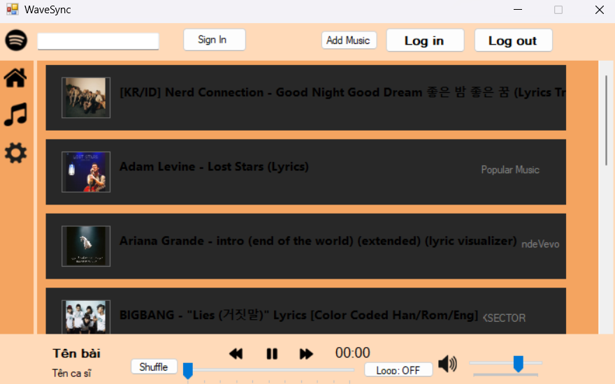

# Nhóm 14 - Lớp IT008.Q12 - UIT - VNUHCM  
# 🎵 WaveSync – Modern Music Player & Library Manager

**WaveSync** là ứng dụng trình phát nhạc và quản lý thư viện âm nhạc được xây dựng bằng C# WinForms với giao diện hiện đại, trực quan và dễ mở rộng.  
Ứng dụng hỗ trợ đăng nhập người dùng, lưu lịch sử nghe nhạc riêng biệt, thêm bài hát mới và phát nhạc với đầy đủ các điều khiển hiện đại.

---

## ✨ Tính năng chính

### 🔐 Quản lý người dùng
- ✅ Đăng nhập
- ✅ Đăng ký
- ✅ Lưu lịch sử nghe nhạc riêng theo từng tài khoản
- ✅ Xác thực và lưu trữ thông tin trong MySQL/LocalDB

### 🎧 Trình phát nhạc (Audio Player)
- ✅ Play / Pause / Stop
- ✅ Next / Previous track
- Rewind / Forward (seek)
- Hàng đợi phát (Queue)
- ✅ Chế độ lặp: Lặp playlist / Lặp 1 bài
- ✅ Hiển thị ảnh bìa bài hát (album art)
- ✅ Thanh điều chỉnh âm lượng + Mute
- ✅ Tự động lưu bài hát đang phát vào History
- ✅ Cho người dùng lưu bài hát yêu thích

### 📚 Quản lý thư viện nhạc
- ✅ Lưu toàn bộ metadata bài hát trong **SQL LocalDB**
- ✅ Thêm bài hát mới qua form riêng (hỗ trợ .mp3, .wav)
- ✅ Tải ảnh bìa tự động hoặc chọn thủ công
- ✅ Tìm kiếm nhanh theo Title / Artist / Album
- Sắp xếp danh sách theo nhiều tiêu chí

### 💾 Cơ sở dữ liệu
- Sử dụng **LocalDB (.mdf)** 
- File database nằm trong thư mục `Data/WaveSyncDB.mdf`
- Quản lý kết nối qua lớp `DatabaseHelper.cs`

---

## 🛠 Công nghệ sử dụng
| Công nghệ                     |      Mục đích                       |
|-------------------------------|-------------------------------------|
| C# (.NET Framework + WinForms)| Giao diện và logic chính            |
| SQL Server LocalDB **2022**   | Lưu trữ người dùng và thư viện nhạc |
| NAudio                        | Phát âm thanh (optional fallback)   |
<!-- | Guna.UI2.WinForms             | Giao diện hiện đại (nếu sử dụng)    | -->
| TagLibSharp                   | Đọc metadata và ảnh bìa từ file     |

---

## 📸 Một số ảnh chụp màn hình (cập nhật dần)
<!--  -->

<!--
 -->

*(Thư mục `Screenshots/` sẽ được cập nhật thường xuyên)*

---

## 🚀 Hướng dẫn cài đặt & chạy dự án
### Cho contributor
### Yêu cầu
- Windows 10/11
- Visual Studio 2022 (Community trở lên) với workload **.NET desktop development**
- SQL Server Express LocalDB 2022 (được cài tự động cùng Visual Studio)
### Cho người dùng phổ thông
- Window 10/11
- SQL Server Express LocalDB 2022