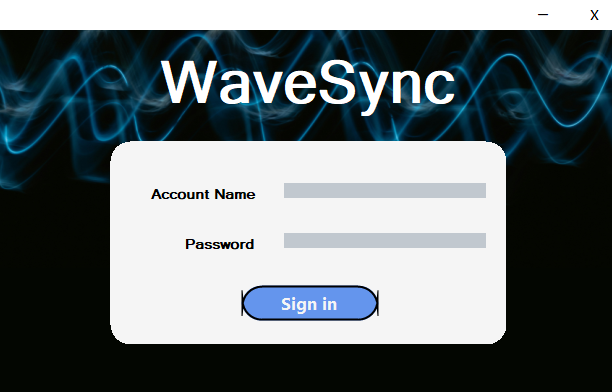
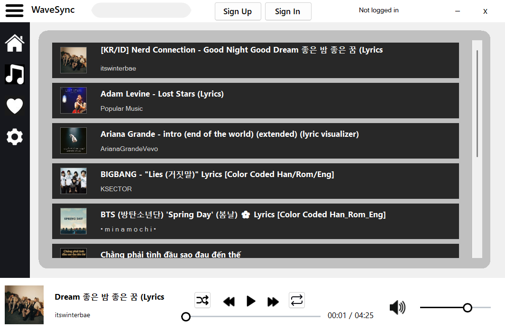
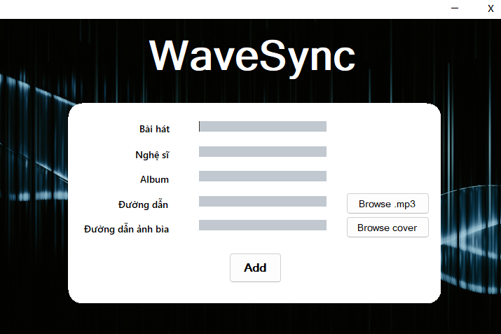

# Nhóm 14 - Lớp IT008.Q12 - UIT - VNUHCM  
# 🎵 WaveSync – Modern Music Player & Library Manager

**WaveSync** là ứng dụng trình phát nhạc và quản lý thư viện âm nhạc được xây dựng bằng C# WinForms với giao diện hiện đại, trực quan và dễ mở rộng.  
Ứng dụng hỗ trợ đăng nhập người dùng, lưu lịch sử nghe nhạc riêng biệt, thêm bài hát mới và phát nhạc với đầy đủ các điều khiển hiện đại.


---

## ✨ Tính năng chính

### 🔐 Quản lý người dùng & Hệ thống
- ✅ **Đăng nhập / Đăng ký:** Hệ thống xác thực an toàn.
- ✅ **Hồ sơ cá nhân:** Người dùng có thể đổi mật khẩu và cập nhật Avatar riêng.
- ✅ **Minimize to Tray:** Thu nhỏ ứng dụng xuống khay hệ thống (System Tray) để chạy nền.

### 🎧 Trình phát nhạc (Audio Player)
- ✅ **Điều khiển đầy đủ:** Play, Pause, Next, Previous, Seek (tua nhạc), Volume control.
- ✅ **Chế độ phát:** - Shuffle (Phát ngẫu nhiên).
	- Loop (Lặp 1 bài / Lặp toàn bộ danh sách nhạc).
- ✅ **Giao diện thông minh:** - Hiệu ứng **Marquee** (chữ chạy) cho tên bài hát/nghệ sĩ quá dài.
  - Hiệu ứng chuyển động (Sliding Animation) cho Sidebar và Settings.
- ✅ **Yêu thích (Favorites):** Thả tim ❤️ để lưu bài hát vào danh sách yêu thích riêng.
- ✅ **Lịch sử:** Tự động lưu lại các bài hát vừa nghe.

### 📚 Quản lý thư viện nhạc
- ✅ Lưu toàn bộ metadata bài hát trong **SQL LocalDB**
- ✅ Thêm bài hát mới qua form riêng (hỗ trợ .mp3, .wav)
- ✅ Tải ảnh bìa tự động hoặc chọn thủ công
- ✅ Tìm kiếm nhanh theo Title / Artist / Album
<!-- - Sắp xếp danh sách theo nhiều tiêu chí -->

### 💾 Cơ sở dữ liệu
- Sử dụng **LocalDB (.mdf)** 
- File database nằm trong thư mục `Data/WaveSyncDB.mdf`
- Quản lý kết nối qua lớp `DatabaseHelper.cs`

---

## 🛠 Công nghệ sử dụng
| Công nghệ                     | Mục đích                                      |
|-------------------------------|-----------------------------------------------|
| **C# (.NET Framework)** | Ngôn ngữ và nền tảng phát triển chính         |
| **SQL Server LocalDB 2022** | Lưu trữ User, Playlist, History, Song Data    |
| **NAudio** | Thư viện xử lý âm thanh (Core Audio Engine)   |
| **TagLib#** | Đọc Metadata (ID3 tags) và Ảnh bìa từ file MP3|
| **Guna.UI2.WinForms** | Hỗ trợ thiết kế giao diện Flat/Modern         |
| **GitHub / Web Hosting** | Lưu trữ file nhạc để đồng bộ (Sync Feature)   |

---

## 📸 Một số ảnh chụp màn hình



---

## 🚀 Hướng dẫn Cài đặt & Chạy (Installation)

### 1. Yêu cầu hệ thống (Prerequisites)
Để ứng dụng hoạt động ổn định, máy tính cần đáp ứng:
- **Hệ điều hành:** Windows 10 hoặc Windows 11.
- **SQL Server Express LocalDB 2022** (Bắt buộc để chạy Database).

### 2. Cách chạy dự án

#### 🧑‍💻 Dành cho Developer / Contributor
Nếu bạn muốn xem code hoặc phát triển thêm:
1. **Công cụ:** Cần cài đặt **Visual Studio 2022** (bản Community trở lên) và tích vào workload **.NET desktop development**.
2. **Clone dự án:**
   ```bash
   git clone [https://github.com/hlongit/WaveSync.git](https://github.com/hlongit/WaveSync.git)
   ```
3. Mở dự án: Chạy file MusicPlayer.sln.
4. Restore Packages: Tại Solution Explorer, chuột phải vào Solution -> chọn Restore NuGet Packages.
5. Chạy: Nhấn Start (F5)

### 👤 Dành cho Người dùng phổ thông (End Users)
Nếu bạn chỉ muốn tải về và sử dụng ngay:
1. Cài đặt LocalDB: - Tải và cài đặt SQL Server LocalDB (khoảng 50MB) từ trang chủ Microsoft nếu máy bạn chưa có.
	- Link tải trực tiếp từ [Microsoft](https://learn.microsoft.com/en-us/sql/database-engine/configure-windows/sql-server-express-localdb?view=sql-server-ver17) (Chọn bản LocalDB 2022).
2. Tải ứng dụng: Vào mục [Releases](https://github.com/hlongit/WaveSync/releases) trên GitHub và tải file .zip.
3. Giải nén: Giải nén toàn bộ file ZIP ra một thư mục.
4. Chạy: Mở file MusicPlayer.exe.